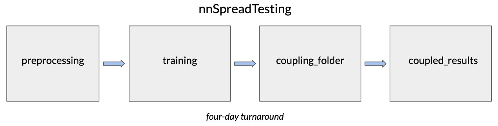

# ClimScale

This codebase is associated with the following preprint (in review):

https://arxiv.org/abs/2309.16177

## Description

ClimScale is an end-to-end pipeline for large-scale testing of neural network parameterizations of Cloud Resolving Models in Super-Parameterized Community Atmosphere Model 3 (SPCAM3).

There are five main folders for this online-testing pipeline:

1.) preprocessing  
2.) training  
3.) coupling_folder  
4.) coupled_results  
5.) analysis

The fifth folder is only used for coupled configuration intercomparison. In other words, this repo should be cloned and modified for every new configuration. Once all the results are created, the analysis folder can be copied and used to analyze and compare the finished results. The offlinetesteval folder generates results on offline test data. Since the "test set" of interest is online performance, the offline test data is relatively small and only used to cross-check validation results. That folder makes use of the ``tf2`` env found in the envs folder. 

## preprocessing

The preprocessing folder contains one Python script and 6 jupyter notebooks. ``preprocessing.py`` is a Python script that defines all the preprocessing functions used by the 6 jupyter notebooks. The 6 jupyter notebooks create training, validation, and test input and target numpy arrays. The environment for this folder corresponds to ``preprocessing_env.txt`` in the envs folder. Code is designed such that one would just need to change functions in ``preprocessing.py`` and designated simulation file path in notebooks when creating new training, validation, and test data for a new configuration. 

## training

The training folder contains code for conducting large-scale testing on Bridges2; however, this code can be adapted for use on other HPCs.

To change the hyperparameter search space, modify the build_model function in ``training_functions.py``. This code also assumes the use of an environment named ``tf2`` that makes use of TensorFlow 2 and keras tuner. The environment I used corresponds to ``tf2_env.txt`` in the envs folder. To change the batch size, number of epochs, training objective, or early stopping callback, make changes to the tuner in 'tuning_template.py'.

Once those scripts have been adjusted for your purposes, you can execute a training run via the terminal command:

``python train_models.py project_name max_trials partition clock_time``

where project_name is replaced by the name of your project, max_trials is replaced by the number of trials you would like to run (I do 110 at a time), partition is replaced by the name of the partition (I use GPU-shared), and clock_time is replaced by the number of time desired on the partition. 

An example would be:

``python train_models.py relative_humidity 110 GPU-shared 24:00:00``

Be sure to do a test run with a small number of trails and less time to debug any errors in training code before executing a large-scale training run. When adding more trials after a previously completed run, simply run the same line and update the number of trials. For example, if you are training 220 models and you have already trained 110, replace 110 with 220 in the above line. 

## coupling_folder

The coupling folder contains the scripts necessary to couple models trained in the training folder. To use it, modify the build_model function in make_models.ipynb to match the hyperparameter search space used for the build_model function in training_functions.py and use make_models.ipynb to convert the trained models to text files that can be coupled thanks to FKB. This folder also makes use of the ``tf2`` folder used in the training folder.

Running the coupled simulations is a one-line command in terminal:

``python master_loop.py family start stop``

where family is replaced by the name of the project, start is the model number you want to start with, and stop is the model number you want to end with. An example would be:

``python master_loop.py relative_humidity 1 330``

## coupled_results

The coupled_results folder is a placeholder folder for runs generated by the coupling_folder. 
